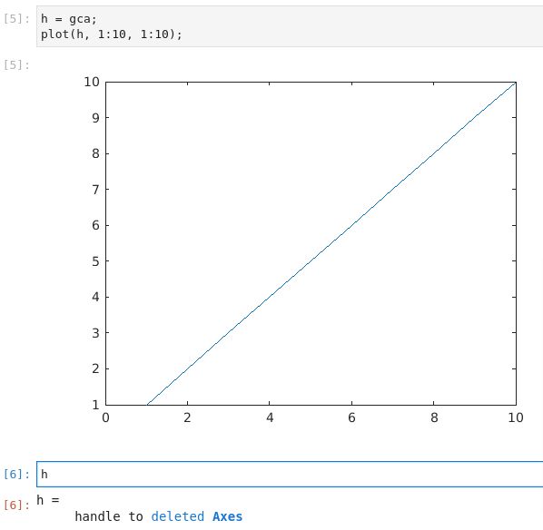
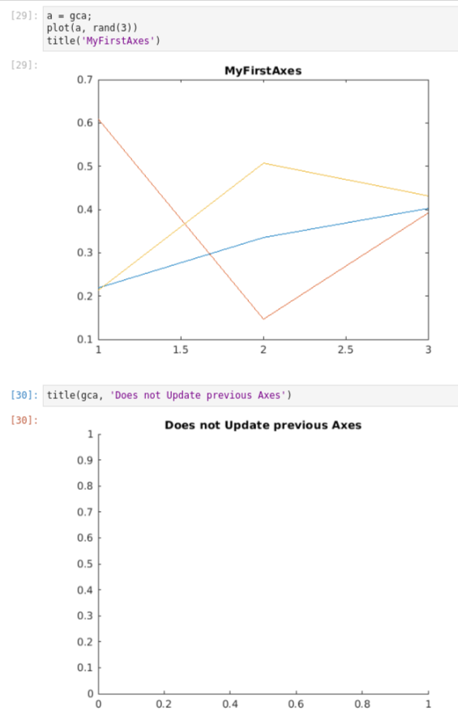

# MATLAB Integration for Jupyter
----
[](https://github.com/mathworks/jupyter-matlab-proxy/actions) [](https://pypi.python.org/pypi/jupyter-matlab-proxy) [](https://codecov.io/gh/mathworks/jupyter-matlab-proxy)

---
This repository shows how you can access MATLAB® from your Jupyter® environment. With MATLAB Integration for Jupyter, you can integrate MATLAB with an existing JupyterHub deployment, single user Jupyter Notebook Server, and many other Jupyter-based systems running in the cloud or on-premises.

Once installed, you can:
|Capability| Example|
|--|--|
|**Run MATLAB code in Jupyter notebook** | <p align="center"></p>|
|**Access MATLAB in a browser**|<p align="center"></p>|

This package supports both Jupyter Notebook and JupyterLab. Some capabilities are limited to the JupyterLab interface.

This package is under active development. To report any issues or suggestions, see the [Feedback](#feedback) section.

----
## Requirements

* Python versions: **3.7** | **3.8** | **3.9**  | **3.10**

* MATLAB R2020b or later is installed and on the system PATH.
  ```bash
  # Confirm MATLAB is on the PATH
  which matlab
  ```
  *note:* MATLAB is only required if you want to execute MATLAB code. Viewing notebooks does not require MATLAB to be installed.

* System dependencies required to run MATLAB.
  - The `base-dependencies.txt` files in the [matlab-deps](https://github.com/mathworks-ref-arch/container-images/tree/master/matlab-deps) repository lists the basic libraries that need to be installed for the desired combination of MATLAB version & Operating system. Refer to the Dockerfiles in the same folder for example usage of these files.</br></br>
  
* For Linux® based systems only, install `X Virtual Frame Buffer (Xvfb)` using:

  Install it on your Linux machine using:
  ```bash
  # On a Debian/Ubuntu based system:
  $ sudo apt install xvfb
 
  # On a RHEL based system:
  $ yum search Xvfb
  xorg-x11-server-Xvfb.x86_64 : A X Windows System virtual framebuffer X server.
  $ sudo yum install xorg-x11-server-Xvfb
  ```
* [Browser Requirements](https://www.mathworks.com/support/requirements/browser-requirements.html)

* Supported Operating Systems:
    * Linux®
    * MacOS

    **NOTE**: Support for Windows is unavailable due to [jupyter-server-proxy/issue#47](https://github.com/jupyterhub/jupyter-server-proxy/issues/147)

## Installation

MATLAB Integration for Jupyter is provided as a Python® package that can be installed from PyPI or built from sources as shown below.

### PyPI
This repository can be installed directly from the Python Package Index using:
```bash
python3 -m pip install jupyter-matlab-proxy
```
Installing this package will not automatically install MATLAB. You must have [MATLAB](https://www.mathworks.com/help/install/install-products.html) installed to execute MATLAB code through Jupyter.


### Building From Sources
Building from sources requires Node.js® version 16 or higher.
To install Node.js, see [Node.js downloads](https://nodejs.org/en/download/).
```bash
git clone https://github.com/mathworks/jupyter-matlab-proxy.git
cd jupyter-matlab-proxy
python3 -m pip install .
```

## Usage

Open your Jupyter environment by starting Jupyter Notebook or JupyterLab:

  ```bash
  # For Jupyter Notebook
  jupyter notebook

  # For JupyterLab
  jupyter lab 
  ```

Upon successful installation of the `jupyter-matlab-proxy` package, your Jupyter 
environment should present several options for using MATLAB in Jupyter.

|Classic Jupyter | JupyterLab |
|--|--|
|<p align="center"></p> | <p align="center"></p> |

## Detailed Usage

### **MATLAB Kernel: Create a Jupyter Notebook using MATLAB kernel for Jupyter**
Click the icon below to launch a notebook:

|Icon | Notebook |
|--|--|
|<p align="center"></p> | <p align="center"></p> |


* The first time you execute code in a MATLAB notebook you will be asked to log in or use a network license manager. Follow the [licensing](#licensing) instructions below.
* Subsequent notebooks in the same server will not request for licensing information.
* Wait for the MATLAB session to start. This can take several minutes.
* **NOTE**: All notebooks in a Jupyter server share the same underlying MATLAB process. Executing code in one notebook will effect the workspace in other notebooks. Users must be mindful of this while working with multiple notebooks at the same time.
* **For MATLAB R2022b and later:** Local functions can be defined at the end of a cell for use in the same cell
    

For more information, see [MATLAB Kernel for Jupyter](src/jupyter_matlab_kernel/README.md).

### **Open MATLAB: Open a browser-based version of the MATLAB development environment from Jupyter**
Click the icon below to open a browser-based version of the MATLAB development environment:
|Icon | Desktop |
|--|--|
|<p align="center"></p> | <p align="center"></p> |

* Notebooks in JupyterLab, also have a `Open MATLAB` shortcut on the top to access the MATLAB desktop.
|

For more information, see [Open MATLAB in a browser](src/jupyter_matlab_proxy/README.md).


### **MATLAB File: Open a new MATLAB file (.m) in JupyterLab**
Click the icon below to start editing a new MATLAB file in a new JupyterLab tab:
|Icon | MATLAB File |
|--|--|
|<p align="center"></p> | <p align="center"></p> |
* MATLAB code in this file will include syntax highlighting.
* You can also use the command palette, by using `CTRL+SHIFT+C` and then typing `New MATLAB File`.
* Execution of `MATLAB Files (.m)` files in JupyterLab is currently **not** supported.


## Licensing

* If prompted to do so, enter credentials for a MathWorks account associated with a MATLAB license. If you are using a network license manager, change to the _Network License Manager_ tab and enter the license server address instead.
To determine the appropriate method for your license type, consult [MATLAB Licensing Info](https://github.com/mathworks/jupyter-matlab-proxy/blob/main/MATLAB-Licensing-Info.md).

<p align="center">

</p>

## Integration with JupyterHub

To use this integration with JupyterHub, you must install the `jupyter-matlab-proxy` Python package in the Jupyter environment launched by your JupyterHub platform. 

For example, if your JupyterHub platform launches Docker containers, then install this package in the Docker image used to launch them.

A reference architecture that installs `jupyter-matlab-proxy` in a Docker image is available at: [Use MATLAB Integration for Jupyter in a Docker Container](https://github.com/mathworks-ref-arch/matlab-integration-for-jupyter/tree/main/matlab).

## Limitations

* Notebooks running on the same server share the same MATLAB. It is currently not possible to have separate workspaces for each notebook.

* Kernels cannot restart MATLAB automatically when users explicitly terminate their MATLAB session using the `exit` command or through the browser-based MATLAB development environment. Users must manually restart MATLAB using the options shown [here](/src/jupyter_matlab_proxy/README.md/#usage).

* Some MATLAB commands are currently not supported in notebooks. These include:

    * Commands that request interactive user input from users. For Example: `input` and `keyboard`.

    * MATLAB Debugger commands. For Example: `dbstep`, `dbup`, and `dbstack`.

    * Commands which require another browser tab to be opened. For Example: `doc` and `appdesigner`.

    * Commands that create animations. For Example: `movie, vibes`.

    * **For MATLAB R2022a and earlier,** `LASTERR` and `LASTERROR` do not capture MATLAB errors from execution in notebooks. 

* Notebook results are truncated when there are more than 10 rows or 30 columns of results from MATLAB. This is represented by a `(...)` at the end of the result. Example:
    ||
    |-|

* Handles from Graphics objects do not persist between cells. For Example:
    ||
    |-|

* Graphics functions like `gca, gcf, gco, gcbo, gcbf, clf, cla` which access `current` handles are **scoped to a notebook cell**. The following example illustrates this:
    ||
    |-|

* Notebooks do not show intermediate figures that were created during execution.

* Outputs from code cells are only displayed after the entire code cell has been run.

* MATLAB notebooks and MATLAB files do not auto-indent after `case` statements.

* Locally licensed MATLABs are currently not supported. Users must either login using Online Licensing or a Network License Manager.

## Troubleshooting
See [Troubleshooting](./troubleshooting.md) for guidance on how to investigate common installation issues.

## Feedback

We encourage you to try this repository with your environment and provide feedback.
If you encounter a technical issue or have an enhancement request, create an issue [here](https://github.com/mathworks/jupyter-matlab-proxy/issues) or send an email to `jupyter-support@mathworks.com`

----

Copyright (c) 2021-2023 The MathWorks, Inc. All rights reserved.

----
